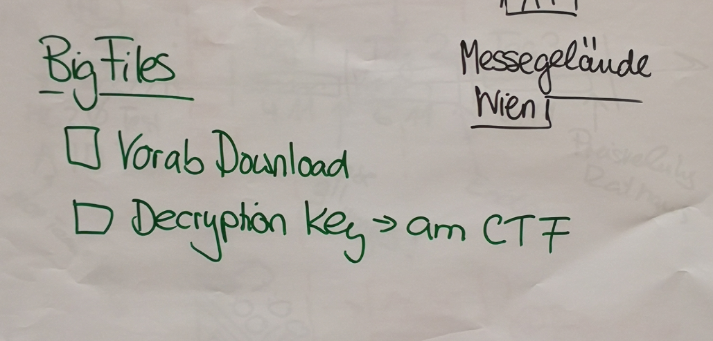

# ECSC 2020 in Vienna
## CTF Mode
* ECSC CTF should include the following challenge types
  * jeopardy challenges
  * attack and defense challenges
  * hw challenges
  

## CSA Requirements
* ACSC and Staatsmeisterschaft must run in parallel with the ECSC final (day 2)
* Staatsmeisterschaft CTF mode changes from 'Single Player' to 'Team Play'
* Very important to use 'virgin' challenges (not used in another training or ctf before)

## Challenge Diversity
Challenges shall test the ECSC players in many subjects. CTF provider must understand that a diverse set of challenges is required. 

* Web Security
* Exploiting
* Network Security
* Crypto
* Reverse Engineering
* Fornensic
* Mobile Security
* HW challenge

## Different Challenges for Day1 and Day2
* Day 1 challenges must be closed at the end of day 1
* Day 2 challenges must be fresh and new for day 2

## Attack and Defense CTF
The attack and defense CTF will run on the Faust CTF framework. But instead of providing dedicated HW to the teams, the whole attack and defense CTF will run fully virtualized in the exo-scale cloud infrastructure. 

## Big Files
If a jeopardy challenge is based on a very large file, this could pose serious bandwith problems for the teams during the ECSC final, if the teams need to download the file from the internet. Thus, these large files shall be encrypted using a secret key and sent out to the ECSC team prior the ECSC final. if such a file is being used in the ECSC final, the CTF provider will share the key to decipher the file. This will speed up the process, as downloading the big file is not required any more, just deciphering. 

## Business Continuity Plan
USB stick based challenges (Jeopardy) must be available in case of a technical problem or issue. 

