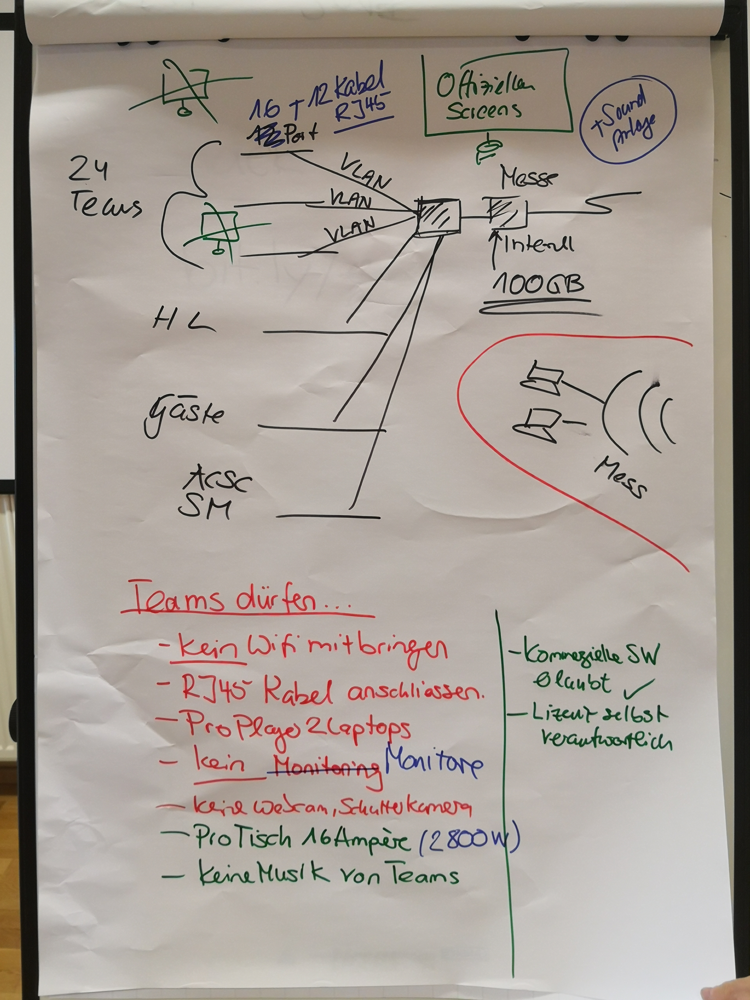

# ECSC 2020 in Vienna
## Infrastructure
This is the first draft of the ECSC CTF network topology planned for the European Cyber Security Challenge Final 2020 in Vienna. Every team has access to its own 16-port VLAN enabled switch. This will be placed on the team table, together with power supplies and RJ45 cables. Teams must take care of adapters and plugs. These will not be provided. Wireless is generally not supported and it is not allowed for the teams to setup their own WiFi access point. Being said, teams must use the provided RJ45 connections. A central VLAN enabled firewall is seperating the networks from the teams. Traffic from team to team is not supported. Insted, every team will get free access to the Internet, where both, the jeopardy CTF and attack/defense CTF will be hosted. 

It would be lovely to have a team notification box on every team's desk. This notification box could be used to run visual (light) or audio (music) whenever the team gains or loses something important. 

## CSA Responsibility
* CSA is taking care of the room, access, keys, light, power, toilet (physical layer)
* CSA is taking care of the internet up-link (Gigabit Uplink, Wired not Wireless, RJ45)
* CSA is taking care of the central vlan enabled firewall
* CSA is taking care of 30 VLAN switches and 14 RJ45 cables per switch (total 30x14=420 cables)
  * 24 VLAN Switchers for the teams
  * 1 VLAN Switch for Hacking-Lab
  * 1 VLAN Switch for Guests
  * 1 VLAN Switch for ACSC Final
  * 1 VLAN Switch for Staatsmeisterschafts Final
  * 1 VLAN Switch for the Live Streaming Team
  * 1 spare VLAN Switches (in case of an emergency)
* CSA is taking care of the tables, chairs, power-supply needed by the teams
* CSA is taking care of the video projectors (front, side left, side right, rear, floor)
* CAS is providing a firewall admin for the CTF (must be available permanently)

## Hacking-Labs Responsibility
* HL is taking care for the jeopardy CTF system (HL 2.0)
* HL is taking care for the attack/defense CTF system
* HL is taking care for the HW related CTF challenges
* HL is taking care for the ranking and scoring service (publicy available to everyone)

