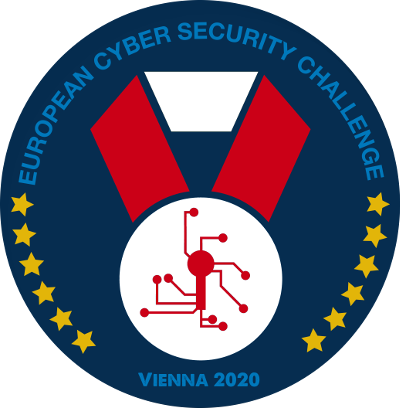

# ECSC 2020 in Vienna
Welcome to the project page of the ECSC final in Vienna 2020. This page will give you more information about the ECSC final 2020 in Vienna, the ctf playing modes, rules and restrictions, organization and responsibilities, players handbook, schedule and more. This page is geared towards the project team and CTF players from the participating countries.

## Logo
Draft **ECSC 2020** logo

## Infrastructure
* Description of the CTF [infrastructure](./Infrastructure.md) 

## Challenges
* Requirements for the [challenges](./Challenges.md)

## Guest Team Canada
* Cyber Security Austria invites [Team Canada](./Canada.md) to participate in the ECSC final 2020 in Vienna

## Rules
* Players handbook, allowed and forbidden [rules](./Rules.md) for the team players

## Schedule
* Draft [schedule](./schedule.md) (Arrival, Prep, Day1, Day2, Award Ceremony, Departure)

## Responsibilities
* Details about the [responsibilities](./Responsibilities.md), roles and duties

## Countries
* Details about the [participating](./Countries.md) countries

